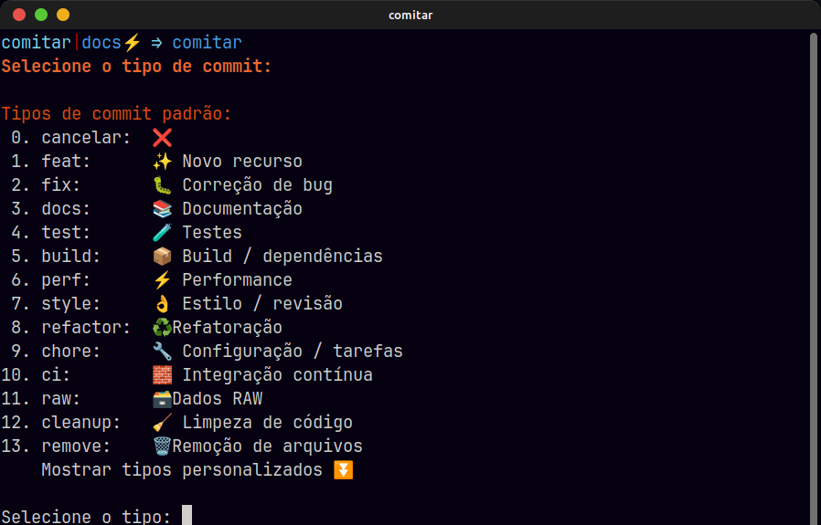
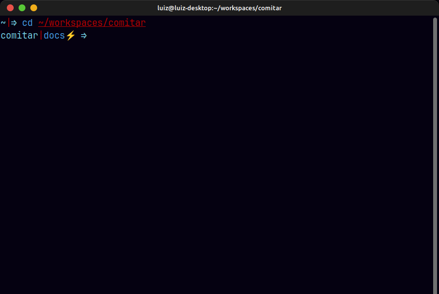
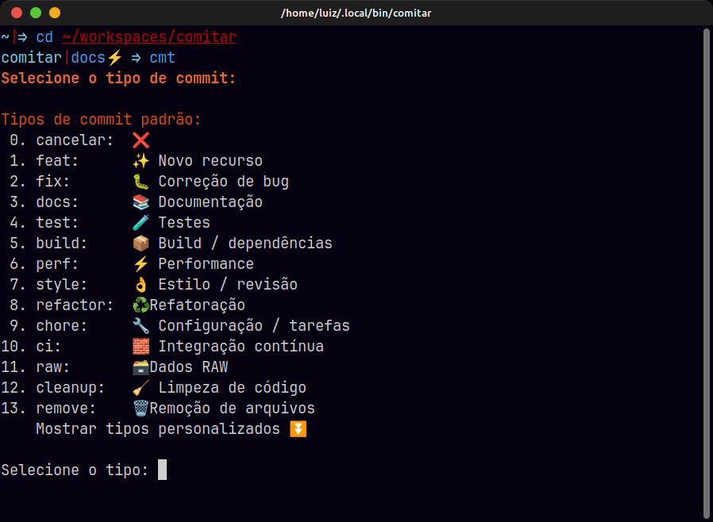
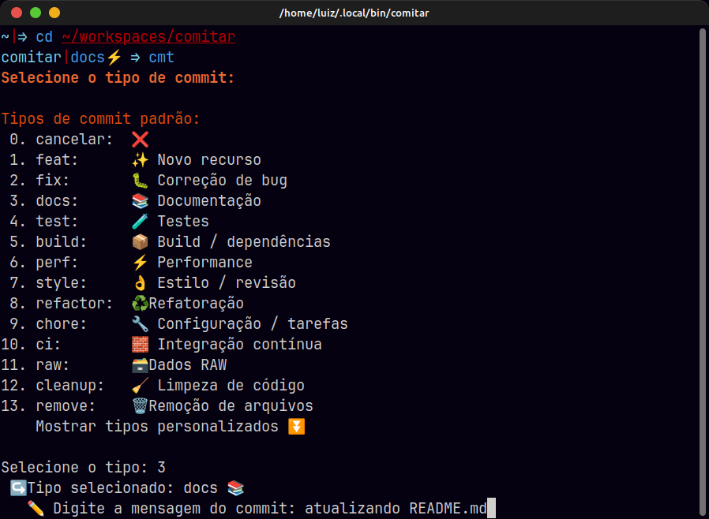
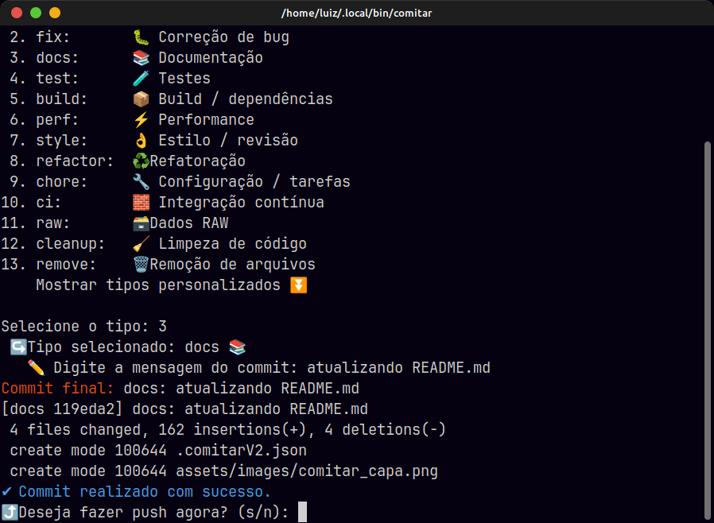
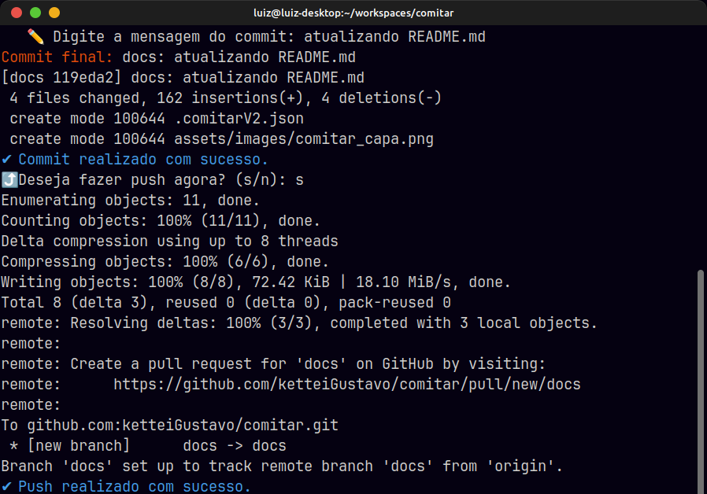

# 🧠 Comitar – Commit Semântico Interativo com Emojis 📝

<h1 align="center">
    
</h1>

> 💬 Ferramenta em Shell Script para criar commits padronizados, com changelog automático, validação de mensagens e instalação simplificada via terminal.
---
[](https://github.com/ketteiGustavo/comitar)
[](https://github.com/ketteiGustavo)
[](./LICENSE)
[](https://github.com/ketteiGustavo/comitar/pulls)
[](https://www.conventionalcommits.org/pt-br/v1.0.0/)
[](./changelog.md)
[](./CODE_OF_CONDUCT.md)
[](./CONTRIBUTING.md)
[](https://conventionalcommits.org)


---
<div align="center">
  Nos ajude com esse projeto
  <br />
  <br />
  <a href="https://github.com/ketteiGustavo/comitar/issues/new?assignees=&labels=&projects=&template=bug_report.md&title=">Reporte um Bug</a>
  ·
  <a href="https://github.com/ketteiGustavo/comitar/issues/new?assignees=&labels=&projects=&template=solicitar_recurso.md&title=">Solicitar um Recurso</a>
  ·
  <a href="https://github.com/ketteiGustavo/comitar/discussions">Faça uma pergunta</a>
</div>

<div align="center">
<br />
</div>

---

## 📖 SOBRE O PROJETO

Commits semânticos seguem uma **[convenção](https://www.conventionalcommits.org/pt-br)** simples e eficiente para padronizar mensagens de commit. Essa prática define um conjunto claro de regras que torna o histórico de alterações mais legível e fácil de entender — tanto por pessoas quanto por ferramentas automatizadas.

Cada commit é identificado por um tipo específico (como funcionalidade, correção, documentação, visual, teste etc.), geralmente acompanhado de um emoji. Isso permite saber rapidamente o que foi alterado sem precisar ler todo o diff.

Adotar essa **[convenção](https://www.conventionalcommits.org/pt-br)** ajuda você e sua equipe a manter o controle do que está sendo desenvolvido, entender a intenção por trás de cada mudança, e facilitar a automação de processos como geração de changelog e versionamento.

---
## 🗂️ ÍNDICE
<details open="open">
<summary>Ver mais</summary>

- [🧠 Comitar – Commit Semântico Interativo com Emojis 📝](#-comitar--commit-semântico-interativo-com-emojis-)
  - [📖 SOBRE O PROJETO](#-sobre-o-projeto)
  - [🗂️ ÍNDICE](#️-índice)
- [Tipos de Commit 🦄](#tipos-de-commit-)
  - [📖 Requisitos](#-requisitos)
  - [🚀 Instalação Rápida](#-instalação-rápida)
  - [✨ Funcionalidades](#-funcionalidades)
  - [📋 Exemplo de uso](#-exemplo-de-uso)
  - [🛠️ Configuração local](#️-configuração-local)
    - [Opções de Configuração](#opções-de-configuração)
  - [📦 Estrutura de commit semântico](#-estrutura-de-commit-semântico)
    - [Exemplos:](#exemplos)
  - [💈 Tipos disponíveis](#-tipos-disponíveis)
  - [🧪 Exemplo visual](#-exemplo-visual)
  - [💻 Execução do `Comitar`](#-execução-do-comitar)
  - [🧩 Estrutura do projeto](#-estrutura-do-projeto)
  - [📑 CONVENÇÃO DE NOMENCLATURAS](#-convenção-de-nomenclaturas)
  - [🧪 Testes](#-testes)
    - [Instalação do BATS](#instalação-do-bats)
    - [Executando os testes](#executando-os-testes)
  - [🖼️ DIAGRAMAS](#️-diagramas)
      - [🚧 Em construção 🚧](#-em-construção-)
  - [⚡ Autocomplete de argumentos](#-autocomplete-de-argumentos)
  - [🧠 Contribuindo](#-contribuindo)
    - [Como Começar](#como-começar)
    - [Reportando Bugs e Sugerindo Melhorias](#reportando-bugs-e-sugerindo-melhorias)
  - [🆘 SUPORTE](#-suporte)
  - [📄 Licença](#-licença)
  - [🤝 CONTRIBUIÇÕES E CONTRIBUIDORES](#-contribuições-e-contribuidores)


</details>


---

# Tipos de Commit 🦄

Os commits semânticos seguem uma estrutura que deixa claro qual foi a intenção da mudança. Cada tipo abaixo representa uma categoria específica de alteração no projeto:

- feat – Adiciona uma nova funcionalidade ao código. Relacionado a mudanças MINOR no versionamento semântico.

- fix – Corrige um bug ou comportamento inesperado. Relacionado a mudanças PATCH.

- docs – Atualiza ou corrige documentação, como o README.md. Não afeta o código em si.

- test – Cria, ajusta ou remove testes. Usado para testes unitários, de integração etc. Sem impacto direto no código de produção.

- build – Modifica arquivos relacionados ao processo de build ou gerenciadores de dependência (como build.gradle, pubspec.yaml).

- perf – Alterações que melhoram o desempenho da aplicação sem alterar comportamento.

- style – Ajustes de formatação, indentação, espaços, lint, remoção de ponto e vírgula, etc. Não afeta lógica do código.

- refactor – Refatorações internas que não alteram funcionalidade (ex: reestruturação de lógica, melhorias após code review, limpeza de duplicações).

- chore – Tarefas rotineiras ou administrativas que não afetam código funcional, como ajustes no .gitignore, atualizações de dependências, scripts, configs.

- ci – Alterações em arquivos e scripts de integração contínua (CI), como workflows do GitHub Actions, GitLab CI, etc.

- raw – Mudanças específicas em arquivos de dados, parâmetros, configurações brutas ou flags de features.

- cleanup – Remoção de código morto, comentado, redundante ou não utilizado, focando na organização e clareza do código.

- remove – Exclusão de arquivos, diretórios ou funcionalidades obsoletas ou que não fazem mais sentido no projeto.

---

## 📖 Requisitos

O `comitar` é uma ferramenta de linha de comando e foi projetado para funcionar em ambientes baseados em Unix (Linux, macOS).

**Dependências obrigatórias:**
- **Git:** Essencial para a instalação (via `git clone`) e para o funcionamento do `comitar`.
- **jq:** Usado para processar arquivos de configuração JSON.
- **Bash:** Versão 4 ou superior.

O script de instalação pode instalar o `git` e o `jq` para você em sistemas baseados em Debian, Red Hat ou Arch, usando a flag `--full`. Para o download do instalador, você precisará de `curl` ou `wget`.

---

## 🚀 Instalação Rápida

O instalador agora clona o repositório oficial para `~/.comitar`, garantindo que as atualizações (`comitar --upgrade`) sejam mais rápidas e seguras.

**Comando de Instalação:**
```bash
bash <(curl -fsSL https://raw.githubusercontent.com/ketteiGustavo/comitar/main/tools/install.sh)
```

**Instalação com dependências (Recomendado):**
Se você não tem certeza se possui `git` e `jq` instalados, use a flag `--full` para que o instalador cuide disso para você:
```bash
bash <(curl -fsSL https://raw.githubusercontent.com/ketteiGustavo/comitar/main/tools/install.sh) -- --full
```

Após a instalação, **reinicie seu terminal** ou execute `source ~/.bashrc` (ou `~/.zshrc`) para que o comando `comitar` e o autocomplete estejam disponíveis.

---

## ✨ Funcionalidades

- ✅ Interface interativa com menu de tipos de commit
- ✅ Emojis automáticos baseados no tipo escolhido
- ✅ Geração de changelog em `.changelog.md`
- ✅ Hook Git opcional para validar commits (`--install-hook`)
- ✅ Push automático com upstream inteligente
- ✅ Configuração dinâmica via `comitar.json` (incluindo cores, emojis e escopo)
- ✅ Autocomplete de argumentos no terminal
- ✅ Scripts auxiliares para upgrade e desinstalação

---

## 📋 Exemplo de uso

```bash
comitar                  # Executa o menu de commits
comitar --commit         # Força o menu mesmo fora de um repositório
comitar --install-hook   # Instala o hook commit-msg no projeto atual
comitar --install-dir    # Especifica o diretório de instalação
comitar --config         # Configura opções do Comitar (cores, emojis, escopo)
comitar --version        # Mostra a versão atual do utilitário
comitar --help           # Exibe ajuda detalhada
comitar --upgrade        # Atualiza o Comitar para a última versão
comitar --uninstall      # Remove completamente o Comitar
comitar --undo           # Desfaz o último commit realizado
```

---

## 🛠️ Configuração local

O `comitar` agora busca o arquivo de configuração `.comitar.json` na raiz do seu repositório Git.

Se o arquivo não for encontrado na primeira execução dentro de um repositório Git, ele será automaticamente copiado do diretório de instalação global (`~/.comitar/config/comitar.json`) para `.comitar.json` na raiz do seu projeto. Além disso, ele será automaticamente adicionado ao `.gitignore` do seu projeto.

Esse arquivo pode ser editado à vontade para personalizar os tipos de commit, caminho do changelog e outras configurações, sem afetar a instalação global do Comitar.

### Opções de Configuração

Você pode configurar as seguintes opções no `.comitar.json` ou interativamente com `comitar --config`:

-   `default_push` (boolean): Se `true`, executa `git push` automaticamente após um commit bem-sucedido. Padrão: `false`.
-   `ask_push` (boolean): Se `default_push` for `false`, esta opção controla se o script deve perguntar ao usuário se deseja fazer o push. Padrão: `true`.
-   `use_commit_body` (boolean): Se `true`, o script solicitará uma descrição longa (corpo) para o commit após a mensagem curta. Padrão: `false`.
-   `use_colors` (boolean): Define se as mensagens do terminal devem usar cores. Padrão: `true`.
-   `use_blinks` (boolean): Define se as mensagens do terminal devem piscar. Padrão: `true`.
-   `use_emojis` (boolean): Define se os commits devem incluir emojis. Padrão: `true`.
-   `use_scope` (boolean): Define se o prompt de commit deve perguntar por um escopo (ex: `feat(auth):`). Padrão: `false`.
-   `version_control` (boolean): Define se o irá controlar a versão do código. Padrão: `false`.
-   `control_file` (file): Define qual o nome do arquivo que terá o controle de versão. (ex. `Pubspec.yaml`)
-   `var_name` (variable): Variável que será apontada para ser alterada caso o `version_control` estiver como `true`.
-   `version_build` (boolean): Define se builds de seus projetos alteram a versão. Padrão: `false`.
-   `default_types` (variable): Padrão de tipos pré-definidos para o `Comitar`.
-   `custom_types` (variable): Tipos customizados para seus projetos.

---

## 📦 Estrutura de commit semântico

```text
:<emoji>: tipo: mensagem resumida
```

### Exemplos:

```bash
git commit -m ":sparkles: feat: Adiciona tela de login"
git commit -m ":bug: fix: Corrige erro ao salvar formulário"
git commit -m ":broom: cleanup: Remove código morto"
```

---

## 💈 Tipos disponíveis

| Tipo         | Emoji | Descrição                     |
|--------------|--------|-------------------------------|
| `feat`       | ✨     | Novo recurso                  |
| `fix`        | 🐛     | Correção de bug               |
| `docs`       | 📚     | Documentação                  |
| `test`       | 🧪     | Testes                        |
| `build`      | 📦     | Build / dependências          |
| `style`      | 👌     | Estilo / revisão              |
| `refactor`   | ♻️     | Refatoração                   |
| `chore`      | 🔧     | Configuração / tarefas        |
| `ci`         | 🧱     | Integração contínua           |
| `deploy`     | 🚀     | Deploy                        |
| `init`       | 🎉     | Commit inicial                |
| `cleanup`    | 🧹     | Limpeza de código             |
| `remove`     | 🗑️     | Remoção de arquivos           |
| `responsive` | 📱     | Responsividade                |
| `animation`  | 💫     | Animações                     |
| `security`   | 🔒️     | Segurança                     |
| `seo`        | 🔍️     | SEO                           |
| `rollback`   | 💥     | Reversão de mudanças          |
| `text`       | 📝     | Texto                         |
| `typing`     | 🏷️     | Tipagem                       |
| `error`      | 🥅     | Tratamento de erros           |
| `raw`        | 🗃️     | Dados / arquivos brutos       |
| `soon`       | 🔜     | Ideias / tarefas futuras      |

---

## 🧪 Exemplo visual

```text
Selecione o tipo de commit:
 1. feat: ✨ Novo recurso
 2. fix: 🐛 Bugfix
 ...
✏️  Digite a mensagem do commit: Padroniza os seus commits em Repositórios
📦 Commit final: :sparkles: feat: Padroniza os seus commits em Repositórios
✔ Commit realizado com sucesso.
✔ Changelog atualizado em .changelog.md
```
---

## 💻 Execução do `Comitar`
Para utilizar o Comitar, após ter instalado, siga o passo-a-passo abaixo:
1. Acesse o diretório do seu projeto/repositório Git.
  

2. Execute o comando `comitar` ou se preferir o alias que foi instalado `cmt`
  

3. Selecione o tipo desejado no menu e informe a mensagem do commit
  

4. Faça o push para o repositório pressionando `s`
  
  

5. Repita quantas vezes for necessário 😎

---


## 🧩 Estrutura do projeto

```text
.comitar/
├── bin/
│   └── comitar
├── assets/
│   └── images/
│       ├── comitar001.png
│       ├── comitar002.png
│       ├── comitar003.png
│       ├── comitar004.png
│       ├── comitar005.png
│       └── comitar_capa.png
├── docs/
│   ├── extensoes-vscode.md
│   ├── guia-git.md
│   ├── guia-markdown.md
│   └── LICENCE
├── config/
│   └── comitar.json
├── hooks/
│   └── commit-check
├── man/
│   ├── cmt.1 -> /home/luiz/workspaces/comitar/man/comitar.1
│   └── comitar.1
├── tests/
│   └── test.sh
├── tools/
│   ├── changelog.sh
│   ├── comitar-autocomplete
│   ├── install.sh
│   ├── uninstall.sh
│   └── upgrade.sh
├── .gitignore
├── comitar.drawio
├── CHANGELOG.md
├── CODE_OF_CONDUCT.md
├── CONTRIBUTING.md
├── LICENSE
├── README.md
├── run_tests.sh
├── SECURITY.md
└── VERSION

```

---

## 📑 CONVENÇÃO DE NOMENCLATURAS

- 🇧🇷 Comentários e prints em **português**
- 🇺🇸 Códigos em **inglês**
- 🐍 **snake_case** para nomes de funções, métodos, variáveis


---

## 🧪 Testes

Para executar os testes automatizados, você precisa ter o `bats-core` instalado.

---

### Instalação do BATS

```bash
sudo apt-get install bats
```

### Executando os testes

Após instalar o `bats`, execute o script `run_tests.sh` na raiz do projeto:

```bash
./run_tests.sh
```

---

## 🖼️ DIAGRAMAS

#### 🚧 Em construção 🚧

---

## ⚡ Autocomplete de argumentos

O `comitar` instala o autocomplete automaticamente para Bash e Zsh.
Se necessário, recarregue o terminal ou execute:

```bash
source ~/.bashrc    # ou ~/.zshrc
```

---

## 🧠 Contribuindo

Contribuições são bem-vindas!

Contribuições são o que torna a comunidade de código aberto um lugar tão incrível para aprender, inspirar e criar. Quaisquer contribuições que você fizer beneficiarão a todos e serão muito apreciadas.

Siga o [CONTRIBUINDO](CONTRIBUTING.md) desse projeto.

### Como Começar

1.  **Faça um Fork do Repositório**
    Clique no botão "Fork" no canto superior direito desta página para criar uma cópia do repositório na sua própria conta do GitHub.

2.  **Clone o Seu Fork**
    Agora, clone o repositório que você acabou de "forkar" para a sua máquina local. Substitua `SEU-USUARIO` pelo seu nome de usuário do GitHub.
    ```bash
    git clone git@github.com:SEU-USUARIO/comitar.git
    cd comitar
    ```

3.  **Crie uma Nova Branch**
    Crie uma branch para trabalhar na sua nova funcionalidade ou correção.
    ```bash
    git checkout -b minha-incrivel-melhoria
    ```

4.  **Faça suas Alterações e Commits**
    Faça as modificações desejadas no código. Use o próprio `comitar` para criar seus commits semânticos!
    ```bash
    comitar --commit
    ```

5.  **Envie suas Alterações (Push)**
    Envie a sua branch para o seu fork no GitHub.
    ```bash
    git push origin minha-incrivel-melhoria
    ```

6.  **Abra um Pull Request (PR)**
    Volte para a página do seu fork no GitHub. Você verá um botão para "Compare & pull request". Clique nele, descreva suas alterações e abra o PR. A equipe do projeto irá revisar suas mudanças.

### Reportando Bugs e Sugerindo Melhorias

Se você não quer editar o código, mas encontrou um problema ou tem uma ideia, pode nos ajudar abrindo uma **Issue**. Use um dos nossos templates para garantir que temos toda a informação necessária:
- **[Reportar um Bug](https://github.com/ketteiGustavo/comitar/issues/new?assignees=&labels=&projects=&template=bug_report.md&title=)**
- **[Sugerir uma Melhoria](https://github.com/ketteiGustavo/comitar/issues/new?assignees=&labels=&projects=&template=solicitar_recurso.md&title=)**

Siga o [Código de Conduta](CODE_OF_CONDUCT.md) desse projeto.


Tente criar relatórios de bugs que sejam:

- Reproduzível. Inclua etapas para reproduzir o problema.
- Específico. Inclua o máximo de detalhes possível: qual versão, qual ambiente, etc.
- Único. Não duplique problemas abertos existentes.
- Escopo para um único bug. Um bug por relatório.

---

## 🆘 SUPORTE
Entre em contato com o mantenedor em um dos seguintes locais:
- [Discusões no GitHub](https://github.com/ketteiGustavo/comitar/discussions)
- Através do perfil no [GitHub](https://github.com/ketteiGustavo)
- Ou através desse [e-mail](mailto:luizg.devlx@gmail.com)

---

## 📄 Licença

Este projeto está sob a licença [GNU General Public License v3.0](LICENSE).

## 🤝 CONTRIBUIÇÕES E CONTRIBUIDORES

Um agradecimento especial a todas as pessoas que contribuíram para este projeto.

<table>
  <tr>
    <td align="center">
      <a href="#">
        <br>
        <sub>
          <b>Luiz Gustavo</b><br>
        </sub>
        <sub>
          <b>Desenvolvedor
        </sub>
      </a>
    </td>
  </tr>
</table>